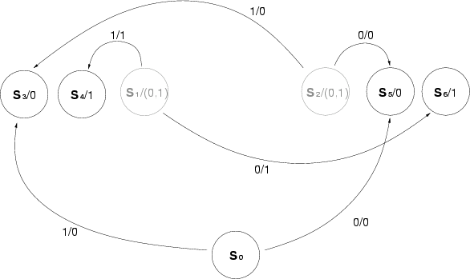

# Zusammmenfassung Automatisierungstechnik

## Themenliste

+ Matlab (?)
+ De Morgan'sche Regeln
+ Bool'sche Algebra
+ KNF und DNF
+ Karnaugh Diagramm
+ K-F-Diagramm
+ Kippschaltungen
+ RS Latch / Flipflop
+ Zustandsgraph
+ Zustandsübergangsdiagramm
+ Systemzustände
+ Schaltfunktionen
+ Fuzzy Logic
+ Neuronale Netze
+ Bayes Netze
+ KNN

## De Morgan'sche Regeln
Die DeMorgan'schen Regeln lauten
$$\neg {(a\wedge b)}=\neg {a}\vee \neg {b}$$
$$\neg {(a\vee b)}=\neg {a}\wedge \neg {b}$$
Sie sind leichter zu merken, wenn man die mathematischen Symbole weglässt:
$$nicht \space (a \space und \space b) = (nicht \space a) \space oder \space (nicht \space b)$$
$$nicht \space (a \space oder \space b) = (nicht \space a) \space und \space (nicht \space b)$$

## Bool'sche Algebra

##### Negation
Die Verneinung einer Aussage A dreht den Wahrheitswert von A in sein Gegenteil um.
$$\lnot A$$

''nicht A''

##### Konjunktion 
Die Konjunktion ist das logische **UND**, ihr Symbol ist:
$$A\land B$$

''A und B''

##### Disjunktion
Die Disjunktion ist das logische **ODER**, ihr Symbol ist:
$$A\lor B$$

''A oder B''

##### Materiale Implikation
Die materiale Implikation, auch Konditional oder Subjunktion genannt, drückt die hinreichende Bedingung aus: Sie sagt, dass die Wahrheit des einen Satzes eine hinreichende Bedingung für die Wahrheit des anderen Satzes ist.
$$A\rightarrow B$$

''Wenn A, dann B''

## KNF und DNF
##### Konjunktive Normalform
Eine Formel der Aussagenlogik ist in konjunktiver Normalform, wenn sie eine Konjunktion von Disjunktionstermen ist. Disjunktionsterme sind dabei Disjunktionen von Literalen. Literale sind nichtnegierte oder negierte Variablen.

Bespiel:
$$(A \vee B \vee C ) \wedge (\bar{A} \vee B \vee C)$$

###### Kanonische konjunktive Normalform
Eine kanonische konjunktive Normalform (KKNF) besteht aus paarweise verschiedenen Maxtermen. In jedem dieser Maxterme kommt jede Variable genau einmal vor.
Jede Boolesche Funktion besitzt genau eine KKNF. Die KKNF wird auch vollständige konjunktive Normalform genannt.

###### Bildung
Jede Formel der Aussagenlogik lässt sich in konjunktive Normalform umwandeln, da sich auch jede boolesche Funktion mit einer KNF darstellen lässt. Dazu genügt es, die Zeilen ihrer Wahrheitstabelle abzulesen. Für jede Zeile, die als Resultat eine 0 liefert, wird eine Klausel gebildet, die alle Variablen der Funktion disjunktiv mit der invertierten Belegung verknüpft. Die entstehenden Terme sind Maxterme. Deren konjunktive Verknüpfung liefert die kanonische konjunktive Normalform.

Diese ist in der Regel keine minimale Formel, das heißt eine Formel mit möglichst wenig Klauseln. Will man eine minimale Formel bilden, so kann man dies etwa mit Hilfe von Karnaugh-Veitch-Diagrammen (kurz KV-Diagrammen) tun.

##### Disjunktive Normalform 
Eine Formel der Aussagenlogik ist in disjunktiver Normalform, wenn sie eine Disjunktion von Konjunktionstermen ist. Ein Konjunktionsterm wird ausschließlich durch die konjunktive Verknüpfung von Literalen gebildet. Literale sind dabei entweder nichtnegierte oder negierte Variablen.

###### Kanonische disjunktive Normalform
Eine kanonische disjunktive Normalform (KDNF), auch vollständige disjunktive Normalform genannt, ist eine DNF, die nur Minterme enthält, in denen alle Variablen vorhanden sind, jede Variable genau einmal vorkommt und deren Minterme alle voneinander verschieden sind. Jede Boolesche Funktion besitzt genau eine KDNF.

In der KDNF sind diejenigen Variablenbelegungen, für die die Funktion den Wert 1 annimmt, durch Minterme ausgedrückt.

###### Bildung
Jede Formel der Aussagenlogik lässt sich in die disjunktive Normalform umwandeln, da sich auch jede Boolesche Funktion mit einer DNF darstellen lässt. Dazu genügt es, die Zeilen ihrer Wahrheitstabelle abzulesen. Für jede Zeile, die als Resultat eine 1 liefert, wird eine Konjunktion gebildet, die alle Variablen der Funktion (der Zeile) verknüpft. Variablen, die in der Zeile mit 1 belegt sind, werden dabei nicht negiert und Variablen, die mit 0 belegt sind, werden negiert. Diese Terme werden auch Minterme genannt. Durch disjunktive Verknüpfung der Minterme erhält man schließlich die disjunktive Normalform.

Auf diese Weise erhält man allerdings in der Regel keine minimale Formel, das heißt eine Formel mit möglichst wenig Termen. Will man eine minimale Formel bilden, so kann man dies mit Hilfe von Karnaugh-Veitch-Diagrammen oder mithilfe des Quine-McCluskey-Verfahrens tun.

## Karnaugh-Veitch-Diagramm

Das Karnaugh-Veitch-Diagramm oder auch K-V-Diagramm ist eine Methode zum bestimmen der optimierten (kleinstmöglichen) Funktion für eine gewünschte Wahrheitstafel, oder auch einen nicht optimierten boolschen Ausdruck, da dieser ja eine Wahrheitstafel für alle möglichen Eingänge liefert.

##### ''Don't Care''-Werte

Sollte eine direkt Wahrheitstafel als Ausgangspunkt dienen, so kann es sein das bestimmte Eingangskonstellationen zu einem beliebigen Ausgangswert führen dürfen, da dieser in der Zielanwendung nicht beachtet werden soll oder ohnehin nicht eintreten kann. In diesem Fall kann im K-V-Diagramm ein ''Don't Care'' eingetragen werden, z.B. durch ein X symbolisiert, hier kann dann unter Berücksichtigung der anderen festen Zielwerte entweder eine 1 oder eine 0 eingetragen werden, je nachdem was eine bessere Optimierung ermöglicht.

## Kippschaltungen

### RS Latch / Flipflop

Das RS-Flip-Flop (nicht-taktgesteuert) ist ein bistabiles Element und der Grundbaustein für alle Flip-Flops in der Digitaltechnik. Man kann dieses Flip-Flop aus zwei NOR-Verknüpfungen oder zwei NAND-Verknüpfungen aufbauen. Beim RS-Flip-Flop mit NOR-Gliedern spricht man von einem 1-aktiven Flip-Flop. Beim RS-Flip-Flop mit NAND-Gliedern spricht man vom 0-aktiven Flip-Flop.
Diese Art von Flip-Flop wird in der Digitaltechnik häufig hinter Schaltern oder Tastern geschaltet um den mechanischen Schaltvorgang prellfrei auswerten zu können.

##### Unterschied RS-Flip-Flop / SR-Flip-Flop

In der Literatur gibt es zwei Bezeichnungen für dieses Flip-Flop: RS-Flip-Flop und SR-Flip-Flop. Unterschied zwischen RS-Flip-Flop und SR-Flip-Flop ist die Dominanz bezogen auf das Q-Signal, wenn sowohl Reset (R) als Set (S) logisch 1 sind. 

Das RS-Flip-Flop ist ein bistabiler Funktionsblock mit dominantem Rücksetzen. Das SR-Flip-Flop ist ein bistabiler Funktionsblock mit dominantem Setzen.

##### Implementierung mit NOR-Gattern

##### Implementierung mit NAND-Gattern

### T-Flip-Flop

### D-Flip-Flop

### JK-Flip-Flop

## Zustandsgraph
## Zustandsübergangsdiagramm

Ein Zustandsübergangsdiagramm ist eine grafische Darstellung von endlichen Automaten, d. h. Zuständen und deren Übergangsbedingungen, um die enthaltenen Verknüpfungen möglichst durchschaubar und eindeutig zu visualisieren.

Anwendung findet das Zustandsübergangsdiagramm im Rahmen der Systemtheorie in den verschiedensten Bereichen der Informatik. Eine wesentliche Vereinheitlichung wurde durch David Harels Statechart-Notation erreicht, welche weithin als die allgemeingültige Form von Zustandsübergangsdiagrammen gesehen wird. Für die objektorientierte Softwareentwicklung ist es mittlerweile im Rahmen der Unified Modeling Language normiert als Zustandsdiagramm.

## Schaltwerkanalyse

##### Stabilität
Ein Schaltwerk ist stabil, wenn:

+ die Reihe der Folgezustände, die das Schaltwerk für jeden der Eingangsvektoren durchläuft, nicht zyklisch ist, sondern in einem für diesen Eingangsvektor stabilen Zustand endet.
+ die Kodierung der Zustände so gewählt werden kann, dass sich beim Übergang der Zustandsvariablen nur ein Bit ändert. Ist dies nicht möglich, kann das Schaltwerk wegen unterschiedlicher Gatterlaufzeiten in fehlerhafte Zustände geraten.

Treten Stabilitätsprobleme auf, können diese durch einen Systemtakt, der einen Zustandsübergang nur zu bestimmten Zeitpunkten ermöglicht, umgangen werden.
Ein solches Schaltwerk bezeichnet man dann als synchrones Schaltwerk, da sich die Zustandsvariablen zum gleichen Zeitpunkt ändern. Dies resultiert jedoch in höheren Kosten für das Schaltwerk.
Ist eine Realisierung des Schaltwerks durch Simulation, z.B. in einer speicherprogrammierbaren Steuerung, vorgesehen, kann man meist von einem Systemtakt ausgehen, der durch den Simulator gegeben ist.

## Zustands-Anregungs-Matrix

## Mealy- / Moore-Automaten 

Mealy- und Moore-Automaten lassen sich ineinander umwandeln. Will man beispielsweise einen Mealy-Automaten in einen Moore-Automaten umwandeln kann man in folgenden drei Schritten vorgehen:

##### Schritt 1: Ausgabe in die Knoten schreiben

Für jede Kante wird die Ausgabe in den Zustand übertragen, auf dem die Kante endet. Hierbei stehen in der Regel verschiedene Ausgabewerte in einem Zustandsknoten.

##### Schritt 2: Knoten aufspalten und eingehende Kanten umhängen

Die Zustände werden vervielfacht, so dass jedem Zustand nur noch höchstens ein Ausgabewert zugeordnet ist; anschließend hängt man eingehende Kanten entsprechend der Ausgabewerte auf die neuen Zustände um.

##### Schritt 3: Ausgehende Kanten vervielfachen

Zuletzt muss man alle ausgehenden Kanten der ursprünglichen Zustände kopieren und an die Zustände aus Schritt 2 anhängen.

Die Ausgabe des so konstruierten Moore-Automaten ist äquivalent zu der des ursprünglichen Mealy-Automaten.

## Systemzustände
## Schaltfunktionen
## Fuzzy Logic

#####  Unscharfe Mengen & Zugehörigkeitsfunktionen

Eine Funktion $m$ ist genau dann ein Element der Menge aller unscharfen Mengen (aller Zugehörigkeitsfunktionen), wenn $m$ eine Funktion ist, die aus der Grundmenge $X$ auf das Einheitsintervall $[0, 1]$ abbildet.

###### Gleichheit

Zwei unscharfe Mengen $A$ und $B$ sind genau dann gleich, wenn für jedes $x$ ihre
Zugehörigkeitsfunktionen den gleichen Wahrheitswert liefern.

###### Zugehörigkeit

Eine unscharfe Menge $A$ ist enthalten in oder Teilmenge von einer unscharfen Menge $B$ genau dann, wenn für jedes $x$ der Wahrheitswert der Zugehörigkeitsfunktion von $A$ kleiner oder gleich dem Wahrheitswert der Zugehörigkeitsfunktion von $B$ ist.

###### Komplement

Das Komplement einer unscharfen Menge $A$ ist die Menge, für die jeder Wahrheitswert ihrer Zugehörigkeitsfunktion für jedes $x$ gerade die Differenz von $1$ und dem Wahrheitswert der Zugehörigkeitsfunktion von $A$ und dem selben $x$ ist.

###### Durchschnitt

Der Durchschnitt zweier unscharfer Mengen $A$ und $B$ ist für jedes $x$ das je-
weilige Minimum der zwei Wahrheitswerte der Zugehörigkeitsfunktionen von $A$ und $B$.

###### Vereinigung

Die Vereinigung zweier unscharfer Mengen $A$ und $B$ ist für jedes $x$ das jeweilige Maximum der zwei Wahrheitswerte der Zugehörigkeitsfunktionen von $A$ und $B$.

## Künstliche Neuronale Netze (KNN)

##### Prozesseinheit (PE)


Das Ausgangssignal y einer PE kann nun folgendermaßen berechnet werden:

$$ y = f\left( \sum \limits_{k=1}^n {(w_k \cdot x_k)}\right)  $$

Wobei gilt:  
$x$ = Eingangsvektor  
$x$ = Ausgangswert  
$w$ = Gewichtungsvektor  
$f(s)$ = Aktivierungsfunktion

Ein neuronales Netz setzt sich aus mehreren PE zusammen Üblicherweise werden dazu verschiedene Schichten von PE untereinander vernetzt

##### Vorteile

+ Lernfähigkeit, Parallelität, Verteilte Wissensrepräsentation
+ Höhere Fehlertoleranz, Assoziative Speicherung von Informationen
+ Robustheit gegen Störungen oder verrauschte Daten
+ Aktive Repräsentation

##### Nachteile

+ Wissenserwerb nur durch Lernen möglich
+ keine Introspektion möglich (z.B. durch "Selbstbeobachtung")
+ Logisches (sequentielles) Schließen ist schwer zu realisieren
+ Lernen ist relativ langsam
