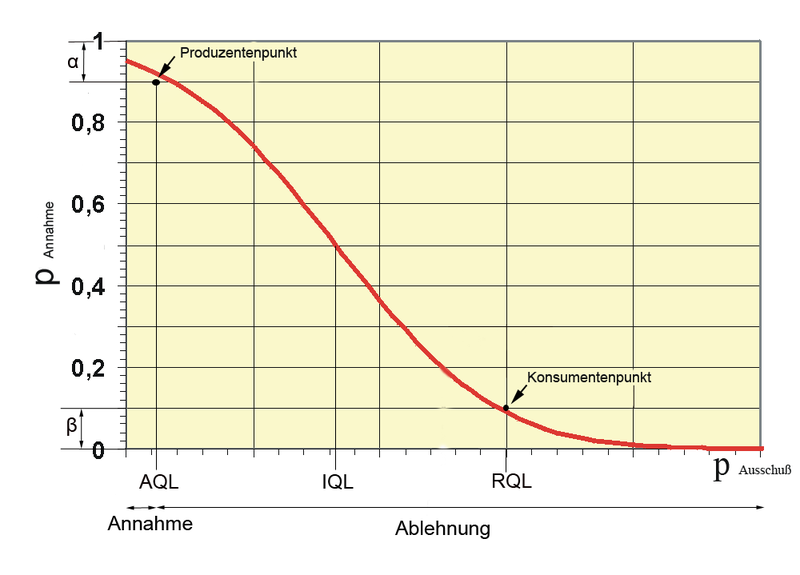

# Qualitätswissenschaft
## Zusammenfassung

### House of Quality

Das HoQ ist das Ergebnis des Quality Function Deployment und stellt Beziehungen zwischen Produktmerkmalen und Kundenerwartungen auf einen Blick grafisch dar.

### Quality Function Deployment

Das QFD ist eine Methode aus dem Projektmanagement. Es dient dazu, zu erarbeiten welche Aspekte eines neuen oder bestehenden Produkt besonders wichtig sind und auch im HInblick auf Konkurrenzprodukte verbessert werden sollten.

 

##### Schritt 1:
**Kundenanforderungen** ermitteln und in Begriffe fassen (Kundenbefragungen). Diese werden im HoQ auf der linken Seite eingetragen.
##### Schritt 2:
Die Kundenanforderungen werden **gewichtet** und zu jeder Anforderungen wird eine Maßzahl notiert (z.B. 0-10).
##### Schritt 3:
Ein vorhandener Prototyp des eigenen Produkts und entsprechende Konkurrenzprodukte werden ein einer **Kundenbewertung** verglichen und auf der rechten Seite des HoQ notiert.
##### Schritt 4:
Die **Produktmerkmale** werden festgelegt und oben unter dem Dach des HoQ eingetragen.
##### Schritt 5:
Bestimmung der **Optimierungsrichtung** es wird für jedes Produktmerkmal festgelegt, in welche Richtung eine Veränderung hinsichtlich der Kundenerwartung vorteilhaft ist (Größer, Kleiner, Idealwert).
##### Schritt 6:
In der Mitte des HoQ werden die **Wechselwirkungen zwischen Produktmerkmalen und Kundenanforderungen** wie in einer Matrix quantitativ eingeschätzt (Schwache Beziehung - Starke Beziehung).
##### Schritt 7:
Das spitze Dach des HoQ ist dazu gedacht hier die **Beziehungen zwischen den Produktmerkmalen** einzuschätzen (Zielkonflikt, Zielharmonie, Zielneutralität).
##### Schritt 8:
**Technische Bedeutung** der Produktmerkmale, die Zahlen für die Beziehung von Kundenanforderungen und Produktmerkmalen werden unten aufaddiert um eine Vorstellung davon zu gewinnnen welche Merkmale besonders bedeutsam sind.
##### Schritt 9:
**Konkrete Zielwerte** für die einzelnen Produktmerkmale werden unter Berücksichtung der bisherigen Ergebnisse festgelegt.
##### Schritt 10:
Die festgelegten Ziele werden nun verwendet, um einen **Produktvergleich mit der Konkurrenz** durchzuführen

### Stochastik

##### Begriffe
|Begriff        |  Definition                                                                                                      |
|---------------|------------------------------------------------------------------------------------------------------------------|
| Vollerhebung  |Ein Experiment wird so oft wiederholt, wie Elemente vorhanden sind, d.h. k-Ziehungen von n-Elementen (wobei k = n)|
| Stichprobe    |Ein Experiment mit n-Elementen wird k-mal wiederholt (wobei k < n)                                                |
| ungeordnet    |Reihenfolge der Ergebnisse ist ohne Bedeutung (z.B. Lotto)                                                        |
| geordnet      |Reihenfolge der Ergebnisse ist wichtig (z.B. Zieleinlauf)                                                         |
| stetige Werte |alle Werte innerhalb eines Intervalls (z.B. benötigte Zeit für einen 100m Lauf)                                   |  
| diskrete Werte|abzählbar viele Werte, z.B. Würfelaugen (d.h. keine Zwischenwerte)                                                |

##### Formelzeichen
|Formelzeichen       |  Konvention                              |
|--------------------|------------------------------------------|
|kleine Buchstaben   |Elementarereignisse                       |
|große Buchstaben    |Menge von Elementarereignissen            |
|P(X)                |Wahrscheinlichkeit, mit der X eintritt    |
|n                   |Anzahl der Versuchswiederholung           |
|k                   |Anzahl der Treffer                        |  
|p                   |Wahrscheinlichkeit für einen Erfolg       |
|q                   |Wahrscheinlichkeit für eine Misserfolg    |
|V(X)                |Varianz                                   |
|E(X)                |Erwartungswert                            |
|$\sigma$ (sigma)    |Standardabweichung, Streuungsmaß          |
|$\epsilon$ (Epsilon)|Umgebung um eine Zahl, Toleranzband       |

### Binomialkoeffizient

Der Binomialkoeffizient gibt an, auf wie viele verschiedene Arten man k Objekte aus einer Menge von n verschiedenen Objekten auswählen kann. Der Versuch wird dabei ohne Zurücklegen und ohne Beachtung der Reihenfolge durchgeführt.

$$ {n \choose k} = \frac{n!}{k! \cdot (n-k)!}$$

### Verteilungen

##### Laplace-Verteilung 

Alle Ereignisse treten mit der gleichen Wahrscheinlichkeit auf, z.B. Münze oder Würfel.

$$ P(A) = \frac{Anzahl \space der \space möglichen \space Erfolge}{Anzahl \space aller \space möglichen \space Ereignisse} $$

##### Binomial-Verteilung

Das Experiment liefert genau zwei Ergebnisse mit den Wahrscheinlichkeiten p für Erfolg und q für Misserfolg.

$$ p + q = 1 $$

$$ P(X=k) = {n \choose k}⋅p^k ⋅q^{(n−k)} $$

##### Hypergeometrische Verteilung

Eine Menge besteht aus N-Elementen. M-Elemente gehören zur Sorte 1, (N-M) Elemente gehören zur Sorte 2. Die Wahrscheinlichkeit, dass bei n-Ziehungen ohne Zurücklegen k-Elemente von Sorte 1 sind, ist:

$$ P(X=k) = \frac{{M \choose k} \cdot {{N-M} \choose {n-k}}}{N \choose n} $$

z.B. Stichprobe auf Funktionsfähigkeit von N-Produkten, von denen M funktionieren und N-M defekt sind.

### Erwartungswert, Varianz, Standardabweichung

##### Erwartungswert

Der Wert der beim unendlich oft durchgeführten Versuch im Mittel erreicht wird. Für große (endliche) Anzahlen von Versuchsdurchführungen kann dieser Wert ''erwartet'' werden.

Ist $X$ eine Zufallsvariable, welche die Werte $x_1$ bis $x_n$annehmen kann, so ist der Erwartungswert:

$$ E(X) = x_1 \cdot P(X=x_1) + x_2 \cdot P(X=x_2) + ... + x_n \cdot P(X=x_n) $$

$$ E(\alpha \cdot X) = \alpha \cdot E(X) \quad \quad E(X+Y) = E(X) + E(Y) $$

##### Varianz

Drückt die quadrierte Abweichung vom Mittelwert aus. (Hohe Varianz $\rightarrow$ Hohe Streuung)

Ist $X$ eine Zufallsvariable, welche die Werte $x_1$ bis $x_n$ annehmen kann, so ist die Varianz:
$$ \mu := E(X) $$

$$ V(X) = E(X - \mu)^2 = E(X^2) - \mu^2 \quad (Verschiebungssatz)  $$

$$ V(X) = (x_1 - \mu)^2 \cdot P(X=x_1) + (x_2 - \mu)^2 \cdot P(X=x_2) + ... + (x_n - \mu)^2 \cdot P(X=x_n) $$

Liegen abgeschlossene Ergebnisse $e_1$ bis $e_n$ vor:

$$ \overline{e} := Mittelwert $$

$$ V(X) = \frac{(e_1 - \overline{e})^2 + (e_2 - \overline{e})^2 + ... + (e_n - \overline{e})^2}{n}$$

##### Standardabweichung

Die Standardabweichung ist die Wurzel der Varianz

$$ \sigma = \sqrt{V(X)}$$

##### Berechnung für die hypergeometrische Verteilung

$$ E(X) = n \cdot \frac{M}{N} $$
$$ V(X) = n \cdot \frac{M}{N} \cdot \left( 1-\frac{M}{N} \right) \cdot \frac{N-n}{N-1} $$

##### Berechnung für die Binomialverteilung

$$ E(X) = n \cdot p \quad \quad V(X) = n \cdot p \cdot q $$

### Hypothesentest

Bei einem Hypothesentest stehen sich zwei einander widersprechende Behauptungen / Vermutungen (sog. Hypothesen) gegenüber. Welche der beiden Hypothesen wahr ist und welche falsch, weiß man nicht und man kann es auch nicht wissen, da in den Hypothesen Aussagen über vom Zufall beeinflusste Vorgänge gemacht werden.

Der Hypothesentest dient nun dazu anhand des Ergebnisses einer Stichprobe zu einer Entscheidung darüber zu kommen, welche der beiden Hypothesen angenommen und welche verworfen wird. 

##### Nullhypothese & Gegenhypothese

Als erstes muss man aus der Aufgabenstellung die beiden einander gegenüberstehenden Hypothesen herauslesen.
In der Regel werden in den beiden Hypothesen Aussagen über die Wahrscheinlichkeit für den Eintritt eines bestimmten Ereignisses gemacht.
Um welches Ereignis handelt es sich? Dieses Ereignis wird dann als Erfolg (im Sinne des Treffers einer Bernoulli-Kette) aufgefasst und seine Wahrscheinlichkeit üblicherweise mit $p$ abgekürzt.

*Beispiel:*  
Bernoulli-Experiment: Anfertigen eines Bauteils durch die Maschine.  
Erfolg mit Warscheinlichkeit $p$: Das Bauteil ist Ausschuss.

Welche Aussagen über $p$ stehen einander gegenüber? Oft wird in der Aufgabenstellung nur eine der beiden Hypothesen konkret formuliert. Die andere muss man dann (zumeist einfach durch logische Verneinung der angegebenen Hypothese) selbst erschließen.
Bei einem Signifikanztest: Welche der beiden Hypothesen ist die Nullhypothese und welche die Gegenhypothese?

*Beispiel:*  
Hypothese 1: "Die Trefferwahrscheinlichkeit $p$ hat sich erhöht"  
Hypothese 2: "Die Trefferwahrscheinlichkeit $p$ hat sich nicht erhöht".

Angenommen wir haben zunächst vermutet das Hyphothese 1 stimmt (weil wir der Drecksmaschine nicht vertrauen), dann wählen wir die andere Hypothese zur Nullhypotese (nehmen also kategorisch an, dass wir uns irren).

Nullhypothese: $H_0: p≤2\% $  
Gegenhypothese: $H_1: p>2\% $

##### Stichprobe

Um zu einer Entscheidung darüber zu gelangen, welche der beiden Hypothesen angenommen und welche verworfen werden soll, plant man nun die Durchführung eine Stichprobe.

Die Anzahl $n$ der Wiederholungen des Zufallsexperiments bezeichnet man als die Länge der Stichprobe.
Das, worauf bei der Durchführung der einzelnen Versuche geachtet wird (also die Anzahl der Eintritte des betreffenden Ereignisses), nennt man die Testgröße. Sie wird manchmal mit $T$, oft auch mit $X$ oder $Z$ abgekürzt.

Bei der Stichpobe handelt es sich dabei um eine Bernoulli-Kette. Die Testgröße ist daher binomialverteilt.

*Beispiel:*  
Länge: Wir werfen die Maschine z.B. 100 mal an.  
Testgröße: Die Maschine produziert z.B. 5-mal Mist.

##### Entscheidungsregel

Abhängig vom Wert, den die Testgröße in der Stichprobe annimmt, wird man die Richtigkeit der einen bzw. der anderen der beiden Hypothesen annehmen.

Diejenigen Werte zwischen $0$ und $n$, bei denen die Richtigkeit der Hypothese $H$ angenommen werden soll, bezeichnet man als den Annahmebereich von $H$. Die anderen Werte, also die, bei denen $H$ verworfen (d.h. abgelehnt) wird, bilden den Ablehnungsbereich von $H$.

Die Entscheidungsregel aufstellen heißt für eine der beiden Hypothesen - üblicherweise für die Nullhypothese - Annahme- und Ablehnungsbereich festzulegen.

##### Fehler 1. und 2. Art

|                         |  $H_0$ ist wahr.  | $H_0$ist falsch.   |
|-------------------------|----------------|-----------------|
| Die Testgröße $T$ nimmt   bei der Stichprobe einen   Wert im Annahmebereich   von $H_0$ an.                 | Richtige Entscheidung               |  **Fehler 2. Art**   $H_0$ ist falsch und wird   zu Unrecht beibehalten.               |
| Die Testgröße $T$ nimmt   bei der Stichprobe einen   Wert im Ablehnungsbereich    von $H_0$ an.             | **Fehler 1. Art**   $H_0$ ist richtig und wird   zu Unrecht verworfen.               | Richtige Entscheidung                |

### OC-Diagramm (Operationscharacteristik)

##### Vorgehen

RQL (Fehler 2. Art) wird mit dem Kunden und AQL (Fehler 1. Art) mit der Produktion festgelegt.  
Die Operationscharakteristik-Funktion muss dann diese Punkte **unter**- (Konsumentenpunkt) bzw. **über**schreiten (Produzentenpunkt). Die Operationscharakteristik-Funktion kann dabei über die Annahmezahl $c$ und den Stichprobenumfang $n$ beeinflusst werden und somit sind die Parameter für das Prüflos bestimmt.

##### IQL

IQL ist die Abkürzung für Indifferente Qualitätslage. Das ist die Qualitätslage, bei der die Annahmewahrscheinlichkeit 50 % beträgt. Dieser Wert ist in der Praxis von geringer Bedeutung.

##### AQL

AQL ist die Abkürzung für ''acceptance quality limit'' (dt. annehmbare Qualitätsgrenzlage), ein Zahlenwert, der – sofern zwischen Kunden und Lieferanten vereinbart – angibt, wie hoch der Ausschussanteil ist, bei dem das Los mit der Wahrscheinlichkeit $1−\alpha$  angenommen wird (Produzentrisiko).

##### RQL

RQL ist die Abkürzung für ''rejectable quality limit'' (dt. rückzuweisende Qualitätsgrenzlage). Ein Zahlenwert, der – sofern zwischen Kunden und Lieferanten vereinbart – angibt, wie hoch der Ausschussanteil ist, bei dem das Los mit der Wahrscheinlichkeit Fehler 2. Art ($\beta$ -Fehler) irrtümlich angenommen wird (Konsumentenrisiko).

### Prozessfähigkeitsindex

Der Prozessfähigkeitsindex gibt an, ob ein Prozess mit den Kenngrößen $\mu$ (Mittelwert) und $\sigma$ (Standardabweichung) bzgl. der Oberen und Unteren Streugrenze $USG$ und $OSG$ (Festgelegt) fähig ist diese Anforderung zu erfüllen. 

##### Prozessfähigkeitsindex

$$c_p = \frac{OSG-USG}{6 \sigma}$$

##### Tatsächlicher Prozessfähigkeitsindex (Verschoben)

Der PFI gibt nur auskunft über die Streuung, berücksichtigt aber nicht ob die Mittlere produzierte Einheit auch in der Mitte der $USG$ und $OSG$ liegt.

$$c_{pK} = \frac{min(\mu - USG, OSG - \mu)}{3 \sigma}$$

##### Grenze

Früher wurde oft ein $c_p$ Wert von $1.0$ akzeptiert, heute wird oftmals ein Wert von $1.33$ oder $2.0$ verwendet.

### Justierung

Nach der Normung wird Justieren wie folgt definiert:  
„Einstellen oder Abgleichen eines Messgerätes, um systematische Abweichungen so weit zu beseitigen, wie es für die vorgesehene Anwendung erforderlich ist. − Justierung erfordert einen Eingriff, der das Messgerät bleibend verändert.“

Die Justierung ist zu unterscheiden von der Kalibrierung, die ein Einmessen ist und ohne Eingriff in das Messgerät durchgeführt wird.

### Perato-Analyse

### Ishikawa-Diagramm
### Vollfaktorieller Versuchsplan / Teilfaktorieller Versuchsplan
### Effektdiagramm
### Fehlermöglichkeits- und Einflussanalyse (FMEA)